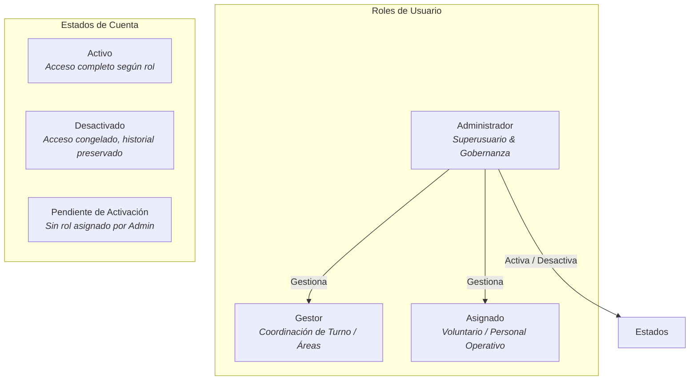
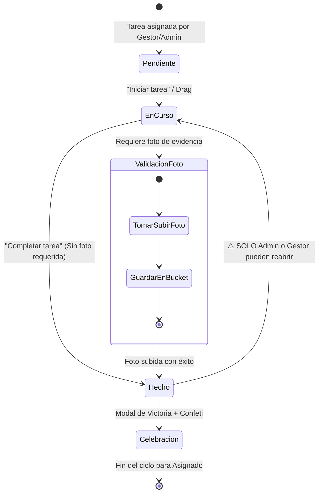
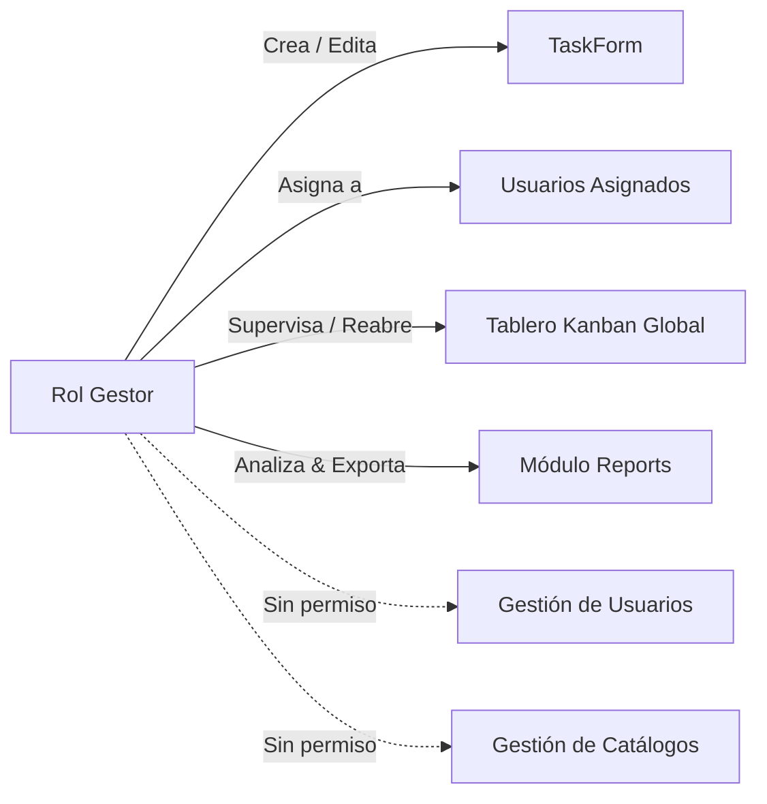
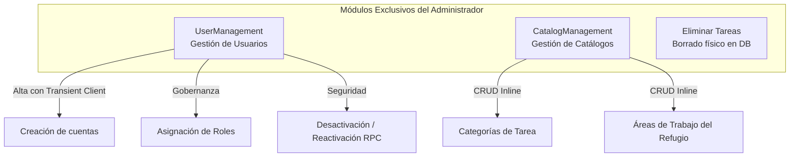
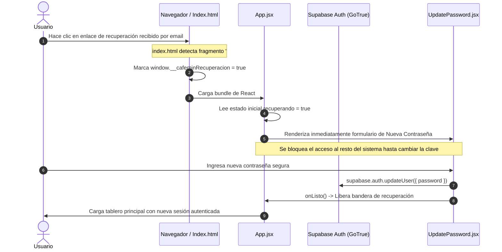

# CAFEMIN Task Tracker · Estado Funcional del Producto por Roles

> **Documento de Contextualización Funcional y de Producto**  
> **Destinatario:** Agentes de IA y equipos encargados de redactar manuales de usuario, especificaciones funcionales, guías de onboarding y documentación operativa.  
> **Fecha de corte:** 4 de septiembre de 2026  
> **Stack tecnológico:** React 18 (Vite SPA) + Tailwind CSS + Supabase (PostgreSQL 16, GoTrue Auth, Private Storage Buckets, Realtime).

---

## 1. Resumen Ejecutivo y Contexto del Proyecto

### 1.1 ¿Qué es CAFEMIN Task Tracker?
**CAFEMIN Task Tracker** es una aplicación web progresiva de gestión operativa y seguimiento ágil de tareas en albergue, desarrollada a medida para **CAFEMIN** (*Casa de Acogida, Formación y Empoderamiento de la Mujer Internacional y Nacional*), un refugio humanitario en la Ciudad de México que brinda estancia digna, alimentación, asesoría legal y acompañamiento integral a personas migrantes y refugiadas (especialmente mujeres, niñas, niños y familias completas).

### 1.2 Principios de Diseño y Operación
1. **Realidad de campo en el albergue:** Quienes ejecutan el trabajo físico diario (voluntariado, apoyo comunitario y personal de intendencia) utilizan teléfonos móviles personales de gama de entrada (pantallas compactas de 320 px a 360 px, muchas veces con una sola mano mientras cargan víveres o insumos).
2. **Protección estricta de datos y dignidad:** La evidencia fotográfica puede capturar a personas en situación de vulnerabilidad humanitaria. Por ello, el almacenamiento no es público; las fotos se resguardan en un bucket privado con políticas de acceso por propiedad y se visualizan únicamente mediante URLs firmadas de vigencia efímera (60 segundos).
3. **Defensa en profundidad:** La interfaz orienta y asiste al usuario, pero **la base de datos (Supabase RLS y Triggers PostgreSQL) es la autoridad final**. Ninguna regla de negocio depende de la buena fe del navegador.
4. **Gamificación con impacto social:** Para el rol operativo (*Asignado/Voluntario*), el sistema integra refuerzo positivo empático, seguimiento de progreso diario y reconocimiento por el impacto humanitario, evitando métricas competitivas o punitivas.

---

## 2. Taxonomía de Roles y Estados de Cuenta

El sistema estructura el acceso y las capacidades en torno a **tres roles funcionales** y **tres estados de cuenta**:

### 2.1 Los Tres Roles de Negocio

| Rol | Perfil Objetivo | Misión Principal en el Sistema | Alcance de Visibilidad |
| :--- | :--- | :--- | :--- |
| **Administrador** | Dirección del albergue, coordinación general, administración de sistemas. | Control total de la plataforma: gobierno de usuarios, catálogo de áreas/categorías, supervisión integral de tareas y toma de decisiones vía analítica. | **Global**: Ve todas las tareas, todos los usuarios y todos los reportes. |
| **Gestor** | Coordinadores de turno, jefes de área (cocina, donaciones, trabajo social, dormitorios). | Asignación operativa de tareas, seguimiento del tablero general, resolución de cuellos de botella y consulta de métricas de cumplimiento. | **Operativa Amplia**: Ve todas las tareas y todos los reportes. Sin acceso a usuarios ni catálogos. |
| **Asignado** | Voluntariado local/internacional, equipo operativo en campo, personal de intendencia y mantenimiento. | Ejecución de tareas del día a día, avance unidireccional del flujo operativo y aportación de evidencia fotográfica cuando se requiera. | **Personal Aislada**: Ve **únicamente** las tareas asignadas a su propio usuario (`asignado_id = auth.uid()`). |

### 2.2 Estados del Perfil y Control de Acceso

1. **Usuario Activo (`activo = true`):**
   - Cuenta validada. Puede iniciar sesión y acceder a las pantallas permitidas según su rol.
2. **Usuario Desactivado (`activo = false`):**
   - Estado establecido por un Administrador mediante la función RPC `desactivar_usuario`.
   - **Mecanismo de corte en dos capas:** 
     1. Base de datos: `get_my_role()` retorna `NULL`, denegando acceso instantáneo vía RLS a todas las tablas incluso con sesión activa abierta.
     2. Autenticación: La cuenta queda vetada en GoTrue Auth (`banned_until` en el futuro), impidiendo nuevos inicios de sesión.
   - **Pantalla mostrada al usuario:** *"Tu acceso está desactivado"* (con icono 🔒 y botón de cerrar sesión).
   - **Preservación histórica:** No se borra la fila física para conservar la autoría y la trazabilidad de tareas completadas en el pasado.
3. **Cuenta Pendiente de Activación (`userProfile == null`):**
   - Ocurre cuando un usuario se registra de manera autónoma (si el registro público estuviese activo) pero un Administrador no le ha asignado rol en la tabla `usuarios`.
   - **Pantalla mostrada al usuario:** *"Cuenta pendiente de activación"* (con icono ⏳).

---

## 3. Matriz Comparativa de Capacidades por Rol

| Módulo / Funcionalidad | Administrador | Gestor | Asignado (Voluntario) | Regla de Integridad / Seguridad |
| :--- | :---: | :---: | :---: | :--- |
| **Navegación general** | | | | |
| Menú "Tareas" (`tasks`) | ✅ Sí | ✅ Sí | ✅ Sí | Todos acceden al tablero Kanban adaptativo. |
| Menú "Reportes" (`reports`) | ✅ Sí | ✅ Sí | ❌ No | Guard en UI (`Navbar.jsx`, `App.jsx`) y RLS. |
| Menú "Usuarios" (`users`) | ✅ Sí | ❌ No | ❌ No | Exclusivo Administrador. RLS bloquea lectura a otros. |
| Menú "Catálogos" (`catalogs`) | ✅ Sí | ❌ No | ❌ No | Exclusivo Administrador. RLS bloquea escritura a otros. |
| **Tablero de Tareas (Kanban / Lista Móvil)** | | | | |
| Alcance de tareas visibles | Todas | Todas | Las suyas **y el pool** | RLS: el Asignado ve `asignado_id = auth.uid()`, **y además** las tareas sin asignar en estado *Pendiente* (política `Asignado see open tasks`). No ve las tareas asignadas a otras personas. |
| Crear nueva tarea (`+ Nueva tarea`) | ✅ Sí | ✅ Sí | ❌ No | Abre `TaskForm`. El Asignado no ve el botón ni ruta. |
| Editar detalles de tarea existente | ✅ Sí | ✅ Sí | ❌ No | Trigger `trg_restrict_asignado_update` (PT001). |
| Eliminar tarea del sistema | ✅ Sí | ❌ No | ❌ No | Botón rojo con confirmación nativa. RLS delete policy. |
| Reabrir tarea desde estado "Hecho" | ✅ Sí | ✅ Sí | ❌ No | Asignado bloqueado por UI y Trigger DB (PT002). |
| Arrastre libre (Desktop DndContext) | ✅ Con manija | ✅ Con manija | ✅ Tarjeta completa | Privilegiados usan manija `⠿⠿` para no bloquear botones. |
| Movimiento forward-only (Pendiente → En curso → Hecho) | ✅ Bidireccional | ✅ Bidireccional | ⚠️ Solo hacia adelante | `puedeMover()` en `flujoTareas.js` y regla PT002. |
| Omitir foto requerida al cerrar | ✅ Permitido | ✅ Permitido | ❌ Prohibido | Decisión de producto: coordinación puede sortear contingencias. |
| Subir evidencia fotográfica | ✅ Opcional | ✅ Opcional | ⚠️ Obligatorio si exige | Trigger PT003 rechaza cierre sin evidencia. |
| Consultar evidencia fotográfica | ✅ Sí (URL firmada) | ✅ Sí (URL firmada) | ✅ Solo propias | URLs de 60s firmadas; Storage RLS compara asignado. |
| **Móvil (< 640 px: `ListaMovil`)** | | | | |
| Vista adaptada en columna única | ✅ Sí | ✅ Sí | ✅ Sí | Pestañas con conteo vivo y targets táctiles ≥44 px. |
| Avance por botón explícito | ✅ Sí | ✅ Sí | ✅ Sí | Botón "Marcar en curso" / "Marcar hecha 📷". |
| Soltar una tarea tomada del pool | — | — | ✅ Sí | RPC `soltar_tarea`. Solo lo propio, solo sin empezar, y solo lo que la persona tomó por su cuenta (PT017–PT019). |
| **Autonomía del voluntariado** | | | | |
| Ver el pool de tareas abiertas | ✅ Sí | ✅ Sí | ✅ Sí | `PoolTareasAbiertas.jsx`. Solo tareas sin asignar en *Pendiente*. |
| Tomar una tarea del pool | ✅ Sí | ✅ Sí | ✅ Sí | RPC `reclamar_tarea_abierta` con `FOR UPDATE`: dos personas no pueden tomar la misma (PT012). |
| Iniciar rutina desde una plantilla | ✅ Sí | ✅ Sí | ✅ Sí | RPC `iniciar_rutina_voluntario`. Una vez por plantilla y por día (PT022). |
| **Bitácora de turno** | | | | |
| Escribir una novedad | ✅ Sí | ✅ Sí | ✅ Sí | Cualquier cuenta activa deja recado al turno siguiente. |
| Leer las novedades | ✅ Todas | ✅ Todas | ⚙️ Según ajuste | Coordinación siempre ve todo. Para el resto lo decide `bitacora_alcance` (ver §5.5). |
| Borrar una novedad | ✅ Sí | Solo las suyas | Solo las suyas | Política `Author or Admin delete bitacora`. |
| **Plantillas de perfil** | | | | |
| Crear / editar / borrar plantillas | ✅ Sí | ✅ Sí | ❌ No | `TemplateManagement.jsx`. RLS restringe escritura a Admin y Gestor. |
| Asignar una plantilla a una persona | ✅ Sí | ✅ Sí | ❌ No | `ModalAsignarPlantilla.jsx`. |
| **Ajustes de operación** | | | | |
| Menú "Ajustes" (`settings`) | ✅ Sí | ❌ No | ❌ No | `Ajustes.jsx`. RLS: solo Administrador escribe en `configuracion`. |
| **Gamificación & Bienestar del Voluntario** | | | | |
| Barra de progreso del turno (`ProgresoVoluntario`) | ❌ Oculta | ❌ Oculta | ✅ Visible | Muestra % del turno, total hechas y mensajes humanos. |
| Modal de victoria (`CelebracionVictoria`) | ❌ Silenciado | ❌ Silenciado | ✅ Activo | Confeti sutil, mensaje de gratitud y autocierre (4s). |
| Mensaje de "Todo al día" (sin tareas pendientes) | Estado general | Estado general | ✅ Tarjeta cálida (☕) | Evita sensación de vacío o error de conexión. |
| **Gestión de Usuarios** | | | | |
| Crear nuevos usuarios | ✅ Sí | ❌ No | ❌ No | Usa `createTransientClient` (evita desloguear al Admin). |
| Cambiar rol a otro usuario | ✅ Sí | ❌ No | ❌ No | Dropdown inline. Protegido contra último Admin (PT006). |
| Desactivar / Reactivar cuenta | ✅ Sí | ❌ No | ❌ No | RPC `desactivar_usuario` / `reactivar_usuario`. |
| **Gestión de Catálogos** | | | | |
| Crear / Editar / Borrar Categorías | ✅ Sí | ❌ No | ❌ No | Edición en línea en tabla `categorias`. |
| Crear / Editar / Borrar Áreas de Trabajo | ✅ Sí | ❌ No | ❌ No | Edición en línea en tabla `areas_trabajo`. |
| **Reportes y Analítica** | | | | |
| Dashboard general con KPIs | ✅ Sí | ✅ Sí | ❌ No | Total, pendientes, curso, hechas, vencidas, % éxito. |
| Tablero de flujo (Espera vs. Trabajo) | ✅ Sí | ✅ Sí | ❌ No | Gracias a sellos `fecha_inicio` y `fecha_hecho`. |
| Pestañas analíticas (Estado, Asignado, Fecha) | ✅ Sí | ✅ Sí | ❌ No | Tablas con acordeón colapsable y orden por columna. |
| Filtros avanzados compartibles en URL | ✅ Sí | ✅ Sí | ❌ No | `enlaceReporte.js` sincroniza filtros con querystring. |
| Exportación a Excel / CSV | ✅ Sí | ✅ Sí | ❌ No | Formato BOM UTF-8 y delimitador `;` para Excel en ES. |
| **Preferencias de Sistema** | | | | |
| Alternar Modo Oscuro / Claro | ✅ Sí | ✅ Sí | ✅ Sí | Botón en Navbar; persiste en `localStorage`. |

---

## 4. Desglose Funcional Detallado por Rol

### 4.1 Rol: Asignado (Voluntarios y Personal Operativo)

El rol Asignado está concebido para personas que están físicamente en las instalaciones de CAFEMIN realizando actividades como preparación de alimentos en cocina, clasificación de ropa y medicamentos, aseo de dormitorios, entrega de kits de higiene o acompañamiento a citas médicas.

#### A. Acceso y Entorno Visual
- **Vistas habilitadas:** Únicamente el Tablero de Tareas (`currentView = 'tasks'`). No ve en el menú Reportes, Usuarios, Catálogos, Plantillas ni Ajustes. Dentro del tablero sí alcanza el pool de tareas abiertas y la bitácora de turno, que son diálogos, no vistas del menú.
- **Filtro automático de información:** Consulta las tareas donde `asignado_id` coincide con su identificador de autenticación, **y además** las tareas *sin asignar* que están en estado *Pendiente* — el pool. **Nunca** ve las tareas asignadas a otra persona.
  > ⚠️ **Corrección respecto a versiones anteriores de este documento:** hasta la migración 12 el alcance era estrictamente `asignado_id = auth.uid()`. La política `Asignado see open tasks` lo amplió. Cualquier manual que afirme *«solo ve lo suyo»* sin matizar quedó desactualizado.
- **Banner de Progreso Voluntario (`ProgresoVoluntario.jsx`):**
  - Ubicado en la parte superior del tablero.
  - Saluda al usuario por su primer nombre (*"¡Hola, María!"*).
  - Si no tiene tareas: Despliega una tarjeta amable con un café (☕) indicando *"¡Todo al día! No tienes tareas asignadas por el momento. Acércate al equipo de coordinación si estás en turno"*.
  - Durante la jornada: Barra de progreso en color esmeralda que indica `X de Y hechas (Z%)` junto a un mensaje motivador aleatorio.
  - Al completar el 100%: Tarjeta conmemorativa destacando que su tiempo y cariño hacen de CAFEMIN un hogar digno y cálido.

#### B. Operación en Pantalla de Escritorio (> 640 px)
- Tablero Kanban horizontal con 3 columnas fijas: **Pendiente**, **En curso** y **Hecho**.
- **Arrastre de tarjeta completa:** El Asignado no necesita buscar una manija diminuta; toda la superficie de la tarjeta responde al arrastre mediante ratón o trackpad.
- **Restricción de dirección:** Puede mover de *Pendiente* a *En curso*, y de *En curso* a *Hecho*. Si intenta arrastrar hacia atrás o sacar una tarjeta de *Hecho*, la interfaz lo cancela y la base de datos lo rechaza.
- **Sin botones destructivos:** Las tarjetas del Asignado no muestran botones de *Editar*, *Eliminar* ni *Reabrir*.

#### C. Operación en Teléfono Móvil (< 640 px: `ListaMovil.jsx`)
- **Por qué no hay Drag & Drop en móvil:** Una pantalla típica de 360 px apenas muestra 328 px utilizables. Un tablero de 3 columnas mide más de 690 px, dejando la columna "Hecho" fuera de la vista física y forzando gestos imprecisos con una sola mano.
- **Interacción por pestañas de estado:** En la parte superior se presentan tres botones con el conteo vivo de tareas: `[Pendiente: 4]` `[En curso: 1]` `[Hecho: 3]`. Cada botón tiene una altura táctil de al menos **44 px** (estándar WCAG para evitar toques erróneos).
- **Acción explícita con un toque:**
  - En la pestaña *Pendiente*, la tarjeta muestra el botón azul: **"Marcar en curso"**.
  - En la pestaña *En curso*, la tarjeta muestra el botón verde: **"Marcar hecha"** (o **"Marcar hecha 📷"** si exige fotografía).
  - Al pulsar el botón, el cambio ocurre de inmediato.
- **Lectura clara de instrucciones:** Tarjeta optimizada con título recortado a 2 líneas y descripción con botón interactivo **"▼ Ver instrucciones"** / **"▲ Ocultar"** para no saturar la pantalla con textos largos.

#### D. Flujo de Evidencia Fotográfica (`PhotoModal.jsx` y `EvidenceLink.jsx`)
- **Detección del requisito:** Si la tarea tiene marcada la casilla `foto_requerida = true` y no tiene aún evidencia, el avance a *Hecho* queda interceptado.
- **Modal de captura:** Se despliega un diálogo emergente indicando la necesidad de adjuntar fotografía.
- **Validación del archivo:**
  - Formatos admitidos: JPEG, PNG, WebP.
  - Tamaño máximo permitido: 5 MB.
- **Subida y persistencia:**
  - Se sube al bucket privado de Supabase Storage: `evidencias/{tarea_id}/{timestamp}.{ext}`.
  - La columna `evidencia_url` almacena **la ruta**, jamás una URL pública directa.
- **Visualización segura:** En las tarjetas donde ya existe evidencia, se muestra el enlace `📷 ver foto`. Al hacer clic, `EvidenceLink` solicita dinámicamente al backend una URL firmada con tiempo de vida de 60 segundos. Si el enlace se comparte externamente, caduca al minuto.

#### E. Reconocimiento de Victoria (`CelebracionVictoria.jsx`)
- Al completar una tarea o la última tarea pendiente del día, se dispara un modal de felicitación.
- Incluye una ráfaga suave de confeti digital en pantalla (respetando la preferencia del sistema operativo si el usuario tiene activada la reducción de movimiento).
- Contiene un mensaje de reconocimiento social enfocado en la labor humanitaria de CAFEMIN.
- Cuenta con auto-cierre automático tras 4 segundos o botón de avance inmediato para no entorpecer el trabajo si el voluntario tiene las manos ocupadas.

---

### 4.2 Rol: Gestor (Coordinadores de Área y Jefes de Turno)

El Gestor es el responsable de orquestar la operación diaria: balancea la carga de trabajo entre voluntarios, define prioridades, atiende contingencias y evalúa el rendimiento del turno.

#### A. Acceso y Entorno Visual
- **Vistas habilitadas:** 
  1. **Tareas (`tasks`):** Tablero global con visibilidad de todas las tareas del albergue.
  2. **Formulario (`form`):** Creación y edición integral de tareas.
  3. **Reportes (`reports`):** Consulta analítica, métricas de ciclo y exportación CSV.
- **Vistas restringidas:** No tiene acceso a *Usuarios* ni *Catálogos*. Los botones no aparecen en su barra de navegación y las rutas directas están bloqueadas por código y RLS.

#### B. Gestión Avanzada del Tablero Kanban
- **Visión panorámica:** Ve todas las tareas creadas en el albergue, independientemente de a quién pertenezcan o si están sin asignar.
- **Interacción Desktop diferenciada:**
  - Para evitar que los clics en botones activen accidentalmente el arrastre de la tarjeta, las tarjetas del Gestor cuentan con una **manija de arrastre dedicada (`⠿⠿`)**.
  - El resto de la tarjeta permanece clicable para interactuar con botones de acción.
- **Capacidades operativas:**
  - **`+ Nueva tarea`:** Botón destacado en el encabezado para crear una asignación rápidamente.
  - **`Editar`:** Botón en cada tarjeta para modificar título, área, asignado, fecha o notas.
  - **`↩ Reabrir`:** En tarjetas ubicadas en la columna *Hecho*, el Gestor cuenta con la facultad de reabrir la tarea y regresarla a *En curso* si la labor requiere correcciones.
  - **Movimiento multidireccional:** A diferencia del Asignado, el Gestor puede mover tarjetas libremente entre cualquiera de las columnas.
  - **Bypass de evidencia fotográfica:** Si una tarea tiene `foto_requerida = true` pero el voluntario no pudo tomarla (p. ej. fallo de batería, urgencia operativa o supervisión presencial del Gestor), el Gestor **puede mover la tarea a *Hecho* sin adjuntar fotografía**.
- **Restricción de borrado:** El Gestor **no puede eliminar tareas definitivamente**. Si una tarea fue creada por error, debe solicitar su eliminación a un Administrador.

#### C. Creación y Edición de Tareas (`TaskForm.jsx`)
Permite capturar todos los atributos de una tarea operativa:
- **Nombre de la tarea (Obligatorio):** Texto descriptivo breve (máximo 120 caracteres).
- **Detalles (Opcional):** Instrucciones específicas paso a paso, medidas de seguridad o contexto (hasta 1,000 caracteres).
- **Categoría:** Menú desplegable alimentado por el catálogo institucional (p. ej. *Alimentación, Salud, Donaciones, Mantenimiento, Acompañamiento*).
- **Área de trabajo:** Menú desplegable del albergue (p. ej. *Cocina, Almacén, Dormitorios, Patio, Consultorio, Recepción*).
- **Asignar a:** Menú desplegable con los usuarios activos del sistema para delegar la responsabilidad.
- **Fecha límite:** Selector de fecha con advertencia visual automática si la tarea llega a su vencimiento sin completarse.
- **Casilla de Foto requerida:** Conmutador para exigir evidencia fotográfica antes del cierre.

#### D. Consulta de Analítica y Reportes
- Acceso completo a los 4 paneles de reportes (Resumen, Por Estado, Por Asignado y Por Fecha).
- Facultad para filtrar, generar enlaces URL compartibles para pasar novedades entre turnos y descargar reportes en CSV para archivar bitácoras operativas.

---

### 4.3 Rol: Administrador (Superusuario y Gobernanza)

El Administrador ostenta la máxima jerarquía del sistema. Posee todas las facultades del Gestor, añadiendo el control administrativo de cuentas de usuario, catálogo de datos institucionales y eliminación definitiva de registros.

#### A. Acceso Total al Sistema
El Administrador visualiza y gestiona las 5 vistas de la aplicación:
`Tareas` | `Nueva/Editar Tarea` | `Reportes` | `Usuarios` | `Catálogos`.

#### B. Eliminación de Tareas
- En el tablero Kanban (tanto en escritorio como en móvil), cada tarjeta muestra un botón rojo **`Eliminar`**.
- Requiere confirmación explícita mediante diálogo de alerta (`window.confirm`).
- Al confirmar, el registro se elimina de la base de datos vía RLS con borrado en cascada correspondiente.

#### C. Gestión Integral de Usuarios (`UserManagement.jsx`)
1. **Alta segura de usuarios:**
   - Permite dar de alta a nuevos integrantes del equipo capturando: Nombre completo, Correo electrónico, Contraseña temporal (mínimo 6 caracteres) y Rol inicial.
   - **Técnica de cliente efímero (`createTransientClient`):** El alta se procesa con una instancia aislada de Supabase que no almacena sesión en `localStorage`. Esto garantiza que **el Administrador no pierda su propia sesión activa al crear una cuenta para un tercero**.
2. **Asignación y cambio de roles:**
   - Tabla interactiva con selector desplegable por usuario para promover o degradar entre *Administrador*, *Gestor* o *Asignado*.
   - **Regla de salvaguarda PT006 (Trigger `proteger_ultimo_administrador`):** La base de datos impide degradar o eliminar al único Administrador restante en la organización, evitando que el sistema quede huérfano de gestión.
3. **Desactivación y Reactivación de Cuentas (`cambiarAcceso`):**
   - **Sustitución del botón Eliminar por Desactivar:** Eliminar a un usuario borraba su registro y dejaba huérfanas todas sus tareas pasadas (`ON DELETE SET NULL`), arruinando la trazabilidad del albergue.
   - Al pulsar *Desactivar*, se invoca el procedimiento almacenado `desactivar_usuario`, que congela permisos vía RLS y banea la credencial en GoTrue.
   - La persona no puede volver a entrar, pero **sus tareas históricas conservan su nombre como autor y responsable**.
   - En cualquier momento, el Administrador puede hacer clic en *Reactivar* para reincorporar al voluntario o trabajador.

#### D. Gestión de Catálogos (`CatalogManagement.jsx`)
Permite adaptar el sistema a la estructura física y organizativa cambiante del refugio mediante dos catálogos con edición directa en pantalla:
1. **Categorías:** Agrupadores temáticos de labor comunitaria (p. ej. *Acompañamiento legal, Salud y primeros auxilios, Higiene y aseo, Alimentación y bodega*).
2. **Áreas de Trabajo:** Espacios físicos del inmueble (p. ej. *Cocina central, Comedor, Dormitorio A, Dormitorio B, Ludoteca, Consultorio, Patio central*).
- **Funcionalidades CRUD:**
  - Agregar nuevo valor con validación de no duplicidad.
  - Edición en línea de nombres existentes con tecla Enter o botón *Guardar*.
  - Eliminación con alerta de confirmación (protegido si existen tareas vinculadas).

---

## 5. Módulos Transversales del Producto

### 5.1 Autenticación y Recuperación de Acceso

- **Login tradicional (`Login.jsx`):** Inicio de sesión con correo electrónico y contraseña.
- **Recuperación de contraseña:** Flujo para solicitar enlace de restablecimiento al correo institucional o personal.
- **Protección contra aterrizaje en falso:** Por defecto, el cliente de Supabase consume y elimina los tokens hash de la URL al inicializarse. En CAFEMIN, un script en `index.html` captura la llegada del evento de recuperación antes de que se monte la aplicación (`window.__cafeminRecuperacion = true`). Esto obliga al usuario a pasar por `UpdatePassword.jsx` antes de permitirle navegar, evitando que entre al sistema con contraseña vulnerable.
- **Modo Demostración (`VITE_DEMO_MODE`):** Cuando este flag está encendido en despliegues de muestra, se ocultan los enlaces de auto-registro y solicitud de recuperación para salvaguardar el entorno.

### 5.2 Módulo de Reportes y Analítica (`Reports.jsx`)

Diseñado para auditorías de donantes, asambleas de la ONG y supervisión de los coordinadores. Se compone de 4 pestañas:

1. **Pestaña Resumen (`Dashboard.jsx`):**
   - **Tarjetas KPI:** Total de tareas registradas, Pendientes, En curso, Hechas, Tareas vencidas fuera de plazo, % Global de cumplimiento.
   - **Tablero de Flujo (Espera vs. Trabajo):** Gracias a la migración `add_fecha_inicio.sql` y al trigger `trg_marcas_de_tiempo`, el sistema mide por separado **cuánto tiempo esperó una tarea para ser atendida** (*desde creación hasta inicio*) y **cuánto tiempo tomó realizarla** (*desde inicio hasta cierre*). Esto evita el sesgo de medir únicamente el tiempo total transcurrido.
   - **Tareas Recurrentes:** Identifica qué actividades se repiten con mayor frecuencia en el refugio para prever insumos.
   - **Balance de Carga:** Gráfica comparativa de tareas asignadas por usuario para evitar sobrecargar a un voluntario específico.
2. **Pestaña Por Estado:** Agrupa las tareas según su estatus con gráficas de barras proporcionales y tablas colapsables de detalle.
3. **Pestaña Por Asignado:** Muestra el rendimiento individual, desglose de tareas completadas y tareas pendientes por persona.
4. **Pestaña Por Fecha:** Agrupación cronológica semanal que permite identificar picos de trabajo en el albergue (llegada masiva de familias, jornadas de donaciones, etc.).

#### Características Clave de Reportes
- **Barra de Filtros Global (`BarraFiltros.jsx`):** Permite filtrar simultáneamente por rango de fechas (desde/hasta), Asignado, Categoría, Área de trabajo, Estado y casilla para *Solo tareas vencidas*. En pantallas chicas (<640px) la barra se contrae en un botón para no asfixiar el espacio de datos.
- **Vistas Compartibles (Deep Linking con `enlaceReporte.js`):** La pestaña activa, los filtros aplicados y la columna de ordenación se sincronizan automáticamente con la URL (`window.location.search`). Un Gestor puede filtrar *"Tareas vencidas de Cocina"* y simplemente copiar el enlace de su navegador; quien lo abra verá exactamente la misma consulta.
- **Exportación CSV de Alta Fidelidad (`csv.js`):** Genera una descarga en formato CSV que exporta todas las columnas de datos. Incorpora el prefijo **BOM UTF-8 (`\uFEFF`)** y el **delimitador de punto y coma (`;`)**, garantizando que el archivo se abra con acentos y formato tabular perfecto en Microsoft Excel configurado en español.

### 5.3 Tiempo Real (Supabase Realtime)
- El tablero Kanban mantiene una suscripción activa al canal `kanban-tareas-{id}` mediante `postgres_changes`.
- Si un voluntario en cocina marca una tarea como *En curso* o *Hecho*, el cambio se refleja de forma instantánea en la pantalla de escritorio del Gestor sin requerir recargar la página (`F5`).

### 5.4 Modo Oscuro (Dark Mode)
- Implementado a nivel raíz con clase `dark` de Tailwind CSS.
- **Persistencia inteligente:** Lee primero la preferencia guardada en `localStorage`. Si el usuario no ha fijado una, adopta la preferencia del sistema operativo (`prefers-color-scheme`).
- **Anti-flash script:** `index.html` ejecuta una comprobación síncrona antes del renderizado de React para evitar el parpadeo de pantalla blanca al recargar de noche.
- Conmutador accesible mediante un toque en la barra de navegación (☀️ / 🌙).

---

### 5.5 Autonomía del Voluntariado: Pool, Plantillas y Bitácora

Los tres módulos comparten una misma tesis de producto: **un voluntario no debería tener que esperar a que alguien le diga qué hacer.** En un albergue con voluntariado rotativo, la coordinación no siempre está disponible en el momento en que alguien llega dispuesto a ayudar.

#### A. Pool de Tareas Abiertas (`PoolTareasAbiertas.jsx`)

Tareas creadas **sin asignar** que cualquiera puede tomar.

- **Qué se ve:** solo tareas con `asignado_id IS NULL` y estado *Pendiente*.
- **Tomar** (`reclamar_tarea_abierta`): usa `SELECT ... FOR UPDATE` para bloquear la fila, de modo que dos personas que pulsan a la vez no puedan tomar la misma tarea (la segunda recibe `PT012`).
- **Consecuencia que hay que entender:** tomar una tarea **la esconde del resto del equipo**, porque un Asignado solo ve lo suyo y lo que está libre. Quien toma muchas y no empieza deja el pool vacío sin haber hecho nada. De ahí los tres mecanismos siguientes.
- **Soltar** (`soltar_tarea`): devuelve al pool una tarea tomada y aún no empezada. Es el inverso de tomar, y existe porque en un teléfono, con una mano, el pulgar se equivoca. **No se puede soltar** lo que asignó la coordinación (`PT019`): eso no es deshacer un error propio, es devolver trabajo que alguien dio, y esa conversación es con esa persona.
- **Devolución automática** (`liberar_reclamos_vencidos`): lo tomado y no empezado vuelve al pool tras el plazo configurado. **No depende de `pg_cron`**: se ejecuta cuando alguien abre el pool, que es justo quien se beneficia de que lo abandonado ya esté libre.
- **Tope opcional:** máximo de tareas tomadas-sin-empezar por persona. Apagado por omisión (`0`). Cuenta **solo lo auto-tomado**: si un Gestor asignó ocho tareas, eso no es acaparar el pool.

> **`reclamada_en`** es la columna que distingue una tarea que un voluntario tomó de una que un Gestor asignó. Es lo que hace segura la devolución automática: lo asignado por coordinación **nunca** se desasigna solo.

#### B. Plantillas de Perfil (`TemplateManagement.jsx`, `ModalIniciarTurno.jsx`)

Un conjunto de tareas recurrentes agrupadas bajo un perfil de jornada (*"Turno de cocina — mañana"*).

- **Quién las mantiene:** Administrador y Gestor.
- **Cómo se usan:** el voluntario pulsa *"Iniciar turno"*, elige un perfil y el sistema le crea de golpe las tareas de esa rutina, ya asignadas a él.
- **Idempotencia:** la misma plantilla no se puede iniciar dos veces el mismo día (`PT022`). El botón del modal ya evita el doble toque, pero la regla vive en la base de datos porque un reintento de red o dos aparatos abiertos bastaban para duplicar la jornada entera de alguien.

#### C. Bitácora de Turno (`BitacoraTurno.jsx`)

Notas en texto libre para entregar el turno: qué quedó pendiente, qué se acabó, qué hay que vigilar.

- **Escribir:** cualquier cuenta activa.
- **Borrar:** el autor o un Administrador. **No hay edición** — la bitácora es un registro que se agrega, no un documento que se corrige.
- **Leer:** aquí está la decisión delicada, y por eso es configurable.

#### D. Ajustes de Operación (`Ajustes.jsx`, tabla `configuracion`)

Pantalla exclusiva del Administrador. Existe porque **dos decisiones de este producto no tienen una respuesta correcta que el código pueda elegir por el albergue.**

| Ajuste | Valores | Por omisión | Qué decide |
| :--- | :--- | :---: | :--- |
| `bitacora_alcance` | `todas` · `area` · `propias` | `todas` | Quién lee las novedades. Coordinación y dirección **siempre** ven todo: leerlas es su trabajo. |
| `bitacora_dias` | entero, `0` = sin límite | `30` | Cuántos días hacia atrás son visibles. |
| `pool_tope_sin_empezar` | entero, `0` = sin tope | `0` | Máximo de tareas tomadas y no empezadas por persona. |
| `pool_dias_para_soltar` | entero, `0` = nunca | `1` | Plazo tras el cual lo tomado y no empezado vuelve al pool. |

**Por qué la bitácora es configurable y no una constante.** Son notas en texto libre sobre la operación diaria de un refugio para mujeres migrantes. Que las lea todo el voluntariado ayuda a coordinar; que las lea todo el voluntariado también significa que una persona que estará dos semanas puede leer todo el historial. Esa es una decisión de la dirección del albergue, no del sistema.

**Cómo se presentan las advertencias.** El aviso va **junto al control** y **cambia según lo que se elija**: ampliar el alcance a *todas* muestra una advertencia ámbar sobre lo que eso implica; elegir *solo su área* muestra una nota gris explicando que el área se deduce de las tareas asignadas, y que quien aún no tiene ninguna no verá nada. Un aviso que dice lo mismo pase lo que pase se vuelve invisible en la segunda visita.

> `get_config()` es `SECURITY DEFINER` a propósito: se invoca **dentro** de las políticas RLS de `bitacora_turnos`, y si leyera `configuracion` con los permisos de quien consulta, una política dependería de otra y PostgreSQL cortaría con un error de recursión a mitad de una consulta normal.

---

## 6. Reglas de Integridad en Base de Datos (Códigos PT)

El sistema implementa restricciones estrictas en PostgreSQL que lanzan códigos de error estandarizados si alguna solicitud viola las políticas de negocio:

| Código | Regla de Negocio Protegida | Explicación del Motivo | Disparador / Origen |
| :---: | :--- | :--- | :--- |
| **`PT001`** | **Inmutabilidad de columnas para Asignado** | Un usuario con rol Asignado únicamente tiene autorización de modificar las columnas `estado` y `evidencia_url`. No puede alterar títulos, fechas límite ni reasignarse tareas. | Trigger `restrict_asignado_update` |
| **`PT002`** | **Prohibición de reapertura por Asignado** | Una tarea marcada como *Hecho* solo puede ser reabierta por un Administrador o Gestor. Esto impide que un ejecutor borre la fecha de cierre o altere las métricas históricas de cumplimiento. | Trigger `restrict_asignado_update` |
| **`PT003`** | **Evidencia obligatoria en tareas con foto** | Si la tarea tiene `foto_requerida = true`, la base de datos aborta cualquier intento de pasar a estado *Hecho* si `evidencia_url` es nula o vacía. | Trigger `restrict_asignado_update` |
| **`PT004`** | **Propiedad de la evidencia** | La ruta del archivo fotográfico debe iniciar con el identificador de la propia tarea (`{task_id}/...`). Impide reciclar una misma fotografía para cerrar múltiples tareas no relacionadas. | Trigger `restrict_asignado_update` |
| **`PT005`** | **Prohibición de desvincular evidencia cerrada** | Una vez que una tarea con foto requerida está en estado *Hecho*, la evidencia no puede ser retirada ni sobreescrita con un valor nulo. | Trigger `restrict_asignado_update` |
| **`PT006`** | **Protección del último Administrador** | Impide que el último Administrador del sistema sea degradado a otro rol o eliminado. Garantiza que la ONG siempre conserve capacidad de gestión sin depender de intervención técnica en base de datos. | Trigger `proteger_ultimo_administrador` |
| **`PT007`–`PT009`** | **Gestión de accesos** | Solo un Administrador cambia el acceso de otra persona (`PT007`); nadie puede desactivar su propio acceso (`PT008`); la persona debe existir (`PT009`). | RPC `desactivar_usuario` / `reactivar_usuario` |
| **`PT010`** | **Cuenta activa para tomar del pool** | Una cuenta desactivada no puede reclamar tareas, aunque su sesión siga abierta. | RPC `reclamar_tarea_abierta` |
| **`PT011`** | **La tarea existe** | Protege contra identificadores inválidos o tareas ya eliminadas. | RPC `reclamar_tarea_abierta` |
| **`PT012`** | **Una tarea, una persona** | Si dos voluntarios pulsan *tomar* a la vez, el bloqueo `FOR UPDATE` garantiza que solo uno gane y el otro reciba un mensaje claro en vez de un estado inconsistente. | RPC `reclamar_tarea_abierta` |
| **`PT013`** | **Solo se toma lo pendiente** | No se puede reclamar una tarea ya en curso o cerrada. | RPC `reclamar_tarea_abierta` |
| **`PT014`** | **Tope de tareas tomadas sin empezar** | Evita que una persona vacíe el pool acaparando tareas que no empieza. Cuenta solo lo auto-tomado, nunca lo que asignó coordinación. Configurable; apagado por omisión. | RPC `reclamar_tarea_abierta` |
| **`PT015`–`PT018`** | **Condiciones para soltar** | Cuenta activa (`PT015`), la tarea existe (`PT016`), es propia (`PT017`) y aún no se empieza (`PT018`). | RPC `soltar_tarea` |
| **`PT019`** | **No se devuelve lo que asignó coordinación** | Solo se puede soltar lo que la persona tomó por su cuenta. Devolver trabajo que un Gestor asignó es una conversación con esa persona, no una acción del sistema. | RPC `soltar_tarea` |
| **`PT020`–`PT021`** | **Condiciones para iniciar rutina** | Cuenta activa (`PT020`) y plantilla existente y activa (`PT021`). | RPC `iniciar_rutina_voluntario` |
| **`PT022`** | **Una rutina por día** | La misma plantilla no se inicia dos veces el mismo día. Sin esta regla, un reintento de red o dos aparatos abiertos duplicaban la jornada completa de una persona. | RPC `iniciar_rutina_voluntario` |

> **El trigger `restrict_asignado_update` conoce el pool.** `reclamar_tarea_abierta` cambia `asignado_id`, que `PT001` prohíbe al rol Asignado — y aunque la función es `SECURITY DEFINER` y se salta RLS, **los triggers siguen disparando**. La migración 14 escribe en el trigger las dos transiciones permitidas —*de nadie a mí* y *de mí a nadie*, siempre en *Pendiente*— en vez de confiar en una bandera que indique por dónde llegó la escritura. Sigue prohibido asignar tareas a otra persona, quitarle trabajo a alguien y mover `reclamada_en` fuera de esas dos transiciones.

---

## 7. Directrices para el Agente Redactor de Documentación

Al utilizar este documento para redactar manuales de usuario, especificaciones de producto o guías de capacitación, se recomienda adoptar los siguientes enfoques según el entregable:

### 7.1 Si se redacta el "Manual del Voluntario / Personal de Campo (Asignado)"
- **Enfoque móvil prioritario:** Estructurar las capturas, explicaciones y pasos asumiendo el uso en teléfono celular vertical (<640 px) con la interfaz `ListaMovil`.
- **Tono empático y claro:** Destacar el sentido de acompañamiento y labor comunitaria. Utilizar términos cotidianos (*"Marcar tarea en curso"*, *"Subir foto del trabajo terminado"*).
- **Explicación del flujo de 3 pasos:** Explicar claramente que las tareas solo avanzan hacia adelante y que, si se cometió un error, deben comunicarlo a su Gestor de turno para que la reabra.
- **Instrucciones sobre la cámara:** Explicar el aviso *"Toma la foto antes de retirarte del área"* para evitar tener que volver al espacio de trabajo.
- **Cómo empezar la jornada sin esperar a nadie:** explicar el botón *"Iniciar turno"* (elegir el perfil de la jornada y recibir sus tareas de golpe) y el pool de *"Tareas disponibles en el albergue"*.
- **Y cómo deshacerlo:** el botón *"↩ Soltar"* devuelve al pool una tarea tomada por error, **siempre que no se haya empezado**. Conviene decirlo explícitamente: es el miedo más común al tocar *tomar* por primera vez.
- **La bitácora es para el turno siguiente,** no un chat. Sugerir qué se escribe ahí: lo que quedó pendiente, lo que se acabó, lo que hay que vigilar.

### 7.2 Si se redacta el "Manual del Coordinador de Turno (Gestor)"
- **Enfoque en supervisión y balance:** Explicar el uso del tablero Kanban de escritorio con manija de arrastre (`⠿⠿`), el botón de reapertura de tareas (`↩ Reabrir`) y la creación ordenada de tareas con fecha límite y asignación equitativa.
- **Buenas prácticas de evidencia:** Orientar sobre cuándo conviene activar la casilla de *Foto requerida* (p. ej. en almacén de medicamentos o inventario de donaciones) y cuándo es innecesaria para no entorpecer el ritmo operativo.
- **Uso de reportes:** Guía paso a paso sobre cómo filtrar tareas por fecha o por área y cómo exportar a CSV para el relevo de guardia.
- **Plantillas de perfil:** cómo armar una rutina de jornada y qué conviene que contenga. Advertir que una plantilla mal armada se multiplica por cada persona que la inicie.
- **Dejar tareas en el pool a propósito:** crear una tarea *sin asignar* es una decisión de coordinación, no un descuido. Sirve para trabajo que cualquiera puede tomar.

### 7.3 Si se redacta el "Manual de Administración y Gobernanza"
- **Gestión de personas:** Detallar cómo dar de alta a nuevos usuarios mediante contraseñas provisionales y cómo desactivar a personas que concluyeron su voluntariado preservando su autoría histórica.
- **Mantenimiento de catálogos:** Explicar cómo mantener limpias las listas de Áreas y Categorías para que los reportes no se fragmenten con nombres duplicados o mal escritos.
- **Seguridad de cuentas:** Recordar la importancia de mantener al menos dos cuentas con rol Administrador para garantizar redundancia operativa en el albergue.
- **Ajustes de operación (§5.5.D):** es la sección con más consecuencias del manual de administración. Explicar que `bitacora_alcance` decide quién lee notas en texto libre sobre la operación diaria de un refugio, y que la elección correcta depende de qué se acostumbre escribir ahí. **No recomendar un valor en el manual**: describir qué implica cada uno y dejar la decisión a la dirección del albergue.
- **El pool y sus frenos:** explicar por qué tomar una tarea la esconde del resto, y por qué la recomendación es empezar con el tope en `0` y subirlo solo si se observa acaparamiento real.
